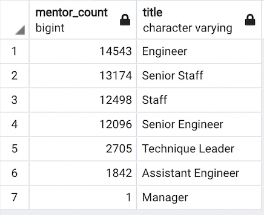

# Silver Tsunami

## Overview
I have been tasked with preparing Pewlett Hackard for the future retirement of many of its employees. Having already parsed through all the employee data to calculate the number of retiring employees, I will then calculate the number of those retiring employees per title. Then, to help Pewlett Hackard transition for the future more efficiently, I will determine which employees are eligible to participate in a new mentorship program. 

---
## Results 
* Many employees had multiple titles while working at Pewlett Hackard:

    

    Basil Ishibashi, in particular, started as an Assistant Engineer before becoming an Engineer and then settling into the current role of Senior Engineer.

* There are a total of 72,458 employees retiring:

    

* The Senior Engineers and the Senior Staff are the hardest hit deparments by the impending retirements.

* The employees born in 1965 are eligible for the mentorship program:

    

    If only the employees born in 1965 are used for the mentorship program, there will be a total of 1,549 mentors.

---
## Summary
### How many roles will need to be filled as the "silver tsunami" begins to make an impact?

Pewlett Hackard is in store for a huge wave of retiring employees. A total of 72,458 employees will need to be replaced soon. Of the total, about seventy percent come from the senior level with 25,916 Senior Engineers and 24,926 Senior Staff retiring. The rest of the retiring employees is made up of 9,285 Engineers, 7,636 Staff members, 3,603 Technique Leaders, 1,090 Assistant Engineers and 2 Managers.

### Are there enough qualified, retirement-ready employees in the departments to mentor the next generation of Pewlett Hackard employees?

Since the employees born in 1965 only include 1,549 possible mentors, then each mentor would have to oversee about 47 employees each. This many new employees per mentor does not seem conducive to the success of those new employees. Cutting down the number of new employees per mentor could lead to better training for the new employees as well as set up Hewlett Packard to withstand the wave of retiring employees and insure the continued success of the company. 

### Additional Insights
Further queries may help Pewlett Hackard plan for the future:

*   Expanding the pool of eligible mentors to employees born from 1962 to 1965 would help lower the ratio of employee to mentor. The bigger pool of mentors would produce 56,859 possible mentors:

    

    Since the pool of retiring employees includes employees born in the three-year time period from 1952 to 1955, it makes sense to expand the mentor pool to employees born in the same amount of time. 

*   Also, what may be even more useful to the organization of the mentorship program would be to seperate the expanded mentor pool by employee title. This would ensure that there would be enough mentors that have the proper experience in the position that the new employee was hired for. Dividing the expanded mentor pool provides a suficient number of mentors per position:

    

    The expanded list of mentors allows a beter ratio of employees to mentor. At most, there will now be 3 employees per mentor and many mentors will just have 1 employee to train. An added benefit of the expanded pool is that there are now extra mentors available to train new employees in case there are other unexpected retirements or if other employees need extra training. Pewlett Hackard would be prepared for any futures changes in their workforce.   